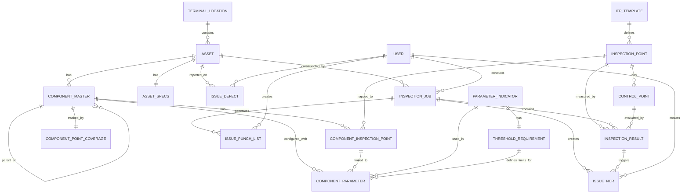

# CES Inspection System - Detailed Entity Diagram

## Comprehensive Entity Relationship Diagram (ERD)



---

## Detailed Entity Definitions

### 1. **TERMINAL_LOCATION** (Gateway/Terminal)
Primary Key: `locationId`

| Field | Type | Required | Description |
|-------|------|----------|-------------|
| locationId | String (UUID) | ✓ | Unique identifier for the terminal location |
| locationName | String | ✓ | Human-readable name of the terminal (e.g., "Singapore Terminal") |
| terminalCode | String | ✓ | Unique code for the terminal (e.g., "SG-01") |
| gpsCoordinates | String (Optional) | ✗ | GPS coordinates in format: "latitude,longitude" |

**Relationships:**
- One-to-Many with ASSET (a terminal contains multiple assets)

---

### 2. **ASSET** (Equipment/Machinery)
Primary Key: `assetId`
Foreign Key: `locationId` (TERMINAL_LOCATION)

| Field | Type | Required | Description |
|-------|------|----------|-------------|
| assetId | String (UUID) | ✓ | Unique identifier for the asset |
| locationId | String (UUID) | ✓ | Reference to TERMINAL_LOCATION |
| assetCode | String | ✓ | Unique asset code (e.g., "STS-001") |
| assetType | Enum | ✓ | Type: 'STS' (Straddle Transfer), 'RTG' (Rubber Tyred Gantry), 'RMG' (Rail Mounted Gantry) |
| description | String | ✓ | Detailed description of the asset |
| manufacturer | String | ✗ | Equipment manufacturer name |
| modelNumber | String | ✗ | Manufacturer's model number |
| serialNumber | String | ✗ | Unique serial number from manufacturer |
| acquisitionDate | Date | ✗ | Date the asset was acquired |
| warrantyExpiry | Date | ✗ | Warranty expiration date |
| diagramUrl | String (URL) | ✗ | URL to 2D technical drawing/diagram |

**Relationships:**
- Many-to-One with TERMINAL_LOCATION
- One-to-Many with COMPONENT_MASTER
- One-to-One with ASSET_SPECS
- One-to-Many with ISSUE_DEFECT
- One-to-Many with INSPECTION_JOB

---

### 3. **ASSET_SPECS** (Technical Specifications)
Primary Key: `specId`
Foreign Key: `assetId` (ASSET)

| Field | Type | Required | Description |
|-------|------|----------|-------------|
| specId | String (UUID) | ✓ | Unique identifier for specs record |
| assetId | String (UUID) | ✓ | Reference to ASSET |
| operatingPressure | Number | ✗ | Operating pressure in bar |
| liftCapacity | Number | ✗ | Maximum lift capacity in tonnes |
| maxSpeed | Number | ✗ | Maximum operating speed in m/s |
| trackGauge | Number | ✗ | Distance between tracks in mm |
| motorPower | Number | ✗ | Motor power rating in kW |
| cycleTime | Number | ✗ | Cycle time in seconds |
| boomLength | Number | ✗ | Boom length in meters |
| spreadsheetCapacity | Number | ✗ | Spread/loading capacity in tonnes |
| wheelDiameter | Number | ✗ | Wheel diameter in mm |
| tireCondition | String | ✗ | Current tire condition (e.g., "Good", "Fair", "Poor") |
| maintenanceHistory | String (Text) | ✗ | Historical maintenance record |
| lastServiceDate | Date | ✗ | Date of last service |
| nextServiceDate | Date | ✗ | Scheduled next service date |
| certifications | String | ✗ | Comma-separated list of certifications (e.g., "ISO 9001, API 2A") |
| createdAt | Date | ✓ | Record creation timestamp |
| updatedAt | Date | ✗ | Record last update timestamp |

**Relationships:**
- One-to-One with ASSET

---

### 4. **COMPONENT_MASTER** (Asset Components)
Primary Key: `componentId`
Foreign Keys: `assetId` (ASSET), `parentComponentId` (self-referencing)

| Field | Type | Required | Description |
|-------|------|----------|-------------|
| componentId | String (UUID) | ✓ | Unique identifier for the component |
| componentCode | String | ✓ | Unique component code (e.g., "MOTOR-001") |
| componentName | String | ✓ | Human-readable component name |
| assetId | String (UUID) | ✓ | Reference to parent ASSET |
| assetType | Enum | ✓ | Applicable asset type: 'STS', 'RTG', 'RMG' |
| category | Enum | ✓ | Component category: 'Structural', 'Electrical', 'Mechanical', 'Hydraulic', 'Software', 'Other' |
| description | String | ✗ | Detailed component description |
| manufacturer | String | ✗ | Component manufacturer |
| modelNumber | String | ✗ | Manufacturer's model number |
| serialNumber | String | ✗ | Unique serial number |
| warrantyExpiry | Date | ✗ | Warranty expiration date |
| criticality | Enum | ✓ | Criticality level: 'Critical', 'High', 'Medium', 'Low' |
| parentComponentId | String (UUID) | ✗ | Reference to parent component (for sub-assemblies) |
| specifications | String (JSON/Text) | ✗ | Technical specifications (JSON or text format) |
| maintenanceIntervalDays | Number | ✗ | Scheduled maintenance interval in days |
| lastMaintenanceDate | Date | ✗ | Date of last maintenance |
| nextMaintenanceDate | Date | ✗ | Scheduled next maintenance date |
| createdAt | Date | ✓ | Record creation timestamp |
| updatedAt | Date | ✗ | Record last update timestamp |
| isActive | Boolean | ✓ | Active/inactive status flag |
| diagramUrl | String (URL) | ✗ | URL to 2D component diagram |

**Relationships:**
- Many-to-One with ASSET
- One-to-Many with COMPONENT_MASTER (self-referencing for hierarchy)
- One-to-Many with COMPONENT_INSPECTION_POINT
- One-to-One with COMPONENT_POINT_COVERAGE
- One-to-Many with COMPONENT_PARAMETER

---

### 5. **ITP_TEMPLATE** (Inspection, Test & Procedure Templates)
Primary Key: `templateId`

| Field | Type | Required | Description |
|-------|------|----------|-------------|
| templateId | String (UUID) | ✓ | Unique identifier for the template |
| templateCode | String | ✓ | Unique template code (e.g., "ITP-STS-001") |
| title | String | ✓ | Template title/name |
| revisionNo | Number | ✓ | Revision number for version control |
| applicableAssetType | Enum | ✓ | Asset type this template applies to: 'STS', 'RTG', 'RMG' |
| standardReference | String | ✓ | Industry standard reference (e.g., "ISO 9001", "API 2A") |
| approvedBy | String | ✗ | Name/ID of approval authority |
| createdAt | Date | ✓ | Template creation timestamp |
| isActive | Boolean | ✓ | Active/inactive status flag |
| description | String | ✗ | Detailed template description |

**Relationships:**
- One-to-Many with INSPECTION_POINT

---

### 6. **INSPECTION_POINT** (Individual Inspection Points/Checkpoints)
Primary Key: `pointId`
Foreign Key: `templateId` (ITP_TEMPLATE), `componentId` (COMPONENT_MASTER - optional)

| Field | Type | Required | Description |
|-------|------|----------|-------------|
| pointId | String (UUID) | ✓ | Unique identifier for the inspection point |
| templateId | String (UUID) | ✓ | Reference to ITP_TEMPLATE |
| componentId | String (UUID) | ✗ | Optional reference to specific COMPONENT_MASTER |
| sequenceOrder | Number | ✓ | Execution sequence order |
| pointDescription | String | ✓ | Description of what needs to be inspected |
| componentCategory | String | ✓ | Category of component being inspected |
| inspectionMethod | Enum | ✓ | Method: 'Visual', 'Ultrasonic', 'Functional Test', 'NDT' |
| isMandatory | Boolean | ✓ | Whether this point is mandatory |
| pointThreshold | String | ✗ | Threshold criteria for passing inspection |
| applicableToComponent | Boolean | ✓ | Whether point applies to component-level inspection |
| applicableToAsset | Boolean | ✓ | Whether point applies to asset-level inspection |

**Relationships:**
- Many-to-One with ITP_TEMPLATE
- One-to-Many with CONTROL_POINT
- One-to-Many with INSPECTION_RESULT
- One-to-Many with COMPONENT_INSPECTION_POINT

---

### 7. **CONTROL_POINT** (Evaluation Criteria)
Primary Key: `controlId`
Foreign Key: `pointId` (INSPECTION_POINT)

| Field | Type | Required | Description |
|-------|------|----------|-------------|
| controlId | String (UUID) | ✓ | Unique identifier for the control point |
| pointId | String (UUID) | ✓ | Reference to INSPECTION_POINT |
| pointType | Enum | ✓ | Type: 'H' (Hold), 'W' (Warning), 'M' (Mandatory), 'R' (Recommendation) |
| description | String | ✓ | Description of the control requirement |
| criteria | String | ✓ | Detailed evaluation criteria |
| frequencyDays | Number | ✗ | Inspection frequency in days |

**Relationships:**
- Many-to-One with INSPECTION_POINT
- One-to-Many with INSPECTION_RESULT

---

### 8. **INSPECTION_JOB** (Inspection Execution)
Primary Key: `jobId`
Foreign Keys: `assetId` (ASSET), `templateId` (ITP_TEMPLATE), `inspectorId` (USER)

| Field | Type | Required | Description |
|-------|------|----------|-------------|
| jobId | String (UUID) | ✓ | Unique identifier for the inspection job |
| assetId | String (UUID) | ✓ | Reference to ASSET being inspected |
| templateId | String (UUID) | ✓ | Reference to ITP_TEMPLATE used |
| jobType | Enum | ✓ | Type: 'Construction', 'Commissioning', 'Routine', 'Special' |
| inspectorId | String (UUID) | ✓ | Reference to USER (inspector) |
| startDate | Date | ✓ | Job start date/time |
| endDate | Date | ✗ | Job completion date/time |
| status | Enum | ✓ | Status: 'Draft', 'In Progress', 'Completed', 'On Hold' |
| notes | String (Text) | ✗ | Additional notes or comments |

**Relationships:**
- Many-to-One with ASSET
- Many-to-One with ITP_TEMPLATE
- Many-to-One with USER (inspector)
- One-to-Many with INSPECTION_RESULT
- One-to-Many with ISSUE_NCR
- One-to-Many with ISSUE_PUNCH_LIST

---

### 9. **INSPECTION_RESULT** (Point Measurement Results)
Primary Key: `resultId`
Foreign Keys: `jobId` (INSPECTION_JOB), `pointId` (INSPECTION_POINT), `controlId` (CONTROL_POINT), `inspectorId` (USER)

| Field | Type | Required | Description |
|-------|------|----------|-------------|
| resultId | String (UUID) | ✓ | Unique identifier for the result |
| jobId | String (UUID) | ✓ | Reference to INSPECTION_JOB |
| pointId | String (UUID) | ✓ | Reference to INSPECTION_POINT |
| controlId | String (UUID) | ✗ | Reference to CONTROL_POINT |
| result | Enum | ✓ | Result: 'Pass', 'Fail', 'N/A' |
| observedValue | String | ✗ | Actual measured/observed value |
| expectedValue | String | ✗ | Expected/threshold value |
| evidence | String (URL/Path) | ✗ | URL or file path to supporting evidence (photos, documents) |
| inspectorNotes | String (Text) | ✗ | Inspector's additional notes |
| inspectionDate | Date | ✓ | Date/time of inspection |
| inspectorId | String (UUID) | ✓ | Reference to USER who conducted inspection |

**Relationships:**
- Many-to-One with INSPECTION_JOB
- Many-to-One with INSPECTION_POINT
- Many-to-One with CONTROL_POINT
- Many-to-One with USER (inspector)
- One-to-Many with ISSUE_NCR

---

### 10. **ISSUE_NCR** (Non-Conformance Reports)
Primary Key: `issueId`
Foreign Keys: `jobId` (INSPECTION_JOB), `resultId` (INSPECTION_RESULT), `createdBy` (USER), `assignedTo` (USER)

| Field | Type | Required | Description |
|-------|------|----------|-------------|
| issueId | String (UUID) | ✓ | Unique identifier for the NCR |
| jobId | String (UUID) | ✓ | Reference to INSPECTION_JOB |
| resultId | String (UUID) | ✓ | Reference to INSPECTION_RESULT |
| issueType | Enum | ✓ | Always 'NCR' (Non-Conformance Report) |
| title | String | ✓ | Issue title/summary |
| description | String | ✓ | Detailed issue description |
| severity | Enum | ✓ | Severity: 'Critical', 'High', 'Medium', 'Low' |
| status | Enum | ✓ | Status: 'Open', 'In Review', 'Resolved', 'Closed' |
| assignedTo | String (UUID) | ✗ | Reference to USER assigned to resolve |
| createdBy | String (UUID) | ✓ | Reference to USER who created the NCR |
| createdAt | Date | ✓ | NCR creation timestamp |
| dueDate | Date | ✗ | Due date for resolution |
| resolution | String (Text) | ✗ | Resolution details and action taken |

**Relationships:**
- Many-to-One with INSPECTION_JOB
- Many-to-One with INSPECTION_RESULT
- Many-to-One with USER (createdBy)
- Many-to-One with USER (assignedTo)

---

### 11. **ISSUE_PUNCH_LIST** (Punch List Items)
Primary Key: `issueId`
Foreign Keys: `jobId` (INSPECTION_JOB), `createdBy` (USER), `assignedTo` (USER)

| Field | Type | Required | Description |
|-------|------|----------|-------------|
| issueId | String (UUID) | ✓ | Unique identifier for the punch list item |
| jobId | String (UUID) | ✓ | Reference to INSPECTION_JOB |
| title | String | ✓ | Item title |
| description | String | ✓ | Detailed description of work/action needed |
| status | Enum | ✓ | Status: 'Open', 'In Progress', 'Completed' |
| assignedTo | String (UUID) | ✗ | Reference to USER assigned to complete |
| createdBy | String (UUID) | ✓ | Reference to USER who created the item |
| createdAt | Date | ✓ | Item creation timestamp |
| dueDate | Date | ✗ | Due date for completion |

**Relationships:**
- Many-to-One with INSPECTION_JOB
- Many-to-One with USER (createdBy)
- Many-to-One with USER (assignedTo)

---

### 12. **ISSUE_DEFECT** (Defect Tracking)
Primary Key: `issueId`
Foreign Keys: `assetId` (ASSET), `createdBy` (USER), `assignedTo` (USER)

| Field | Type | Required | Description |
|-------|------|----------|-------------|
| issueId | String (UUID) | ✓ | Unique identifier for the defect |
| assetId | String (UUID) | ✓ | Reference to ASSET where defect exists |
| title | String | ✓ | Defect title |
| description | String | ✓ | Detailed defect description |
| defectType | Enum | ✓ | Type: 'Fatigue Crack', 'Oil Leak', 'Electrical Fault', 'Mechanical Damage', 'Other' |
| severity | Enum | ✓ | Severity: 'Critical', 'High', 'Medium', 'Low' |
| status | Enum | ✓ | Status: 'Open', 'In Review', 'Resolved', 'Closed' |
| assignedTo | String (UUID) | ✗ | Reference to USER assigned to fix |
| createdBy | String (UUID) | ✓ | Reference to USER who reported defect |
| createdAt | Date | ✓ | Defect report creation timestamp |
| dueDate | Date | ✗ | Due date for resolution |
| resolution | String (Text) | ✗ | Resolution details and action taken |

**Relationships:**
- Many-to-One with ASSET
- Many-to-One with USER (createdBy)
- Many-to-One with USER (assignedTo)

---

### 13. **COMPONENT_INSPECTION_POINT** (Component-Point Mapping)
Primary Key: `mappingId`
Foreign Keys: `pointId` (INSPECTION_POINT), `componentId` (COMPONENT_MASTER), `subComponentId` (COMPONENT_MASTER)

| Field | Type | Required | Description |
|-------|------|----------|-------------|
| mappingId | String (UUID) | ✓ | Unique identifier for the mapping |
| pointId | String (UUID) | ✓ | Reference to INSPECTION_POINT |
| componentId | String (UUID) | ✓ | Reference to parent COMPONENT_MASTER |
| subComponentId | String (UUID) | ✗ | Reference to sub-component COMPONENT_MASTER (optional) |
| applicableToComponent | Boolean | ✓ | Whether applicable to main component |
| applicableToSubComponent | Boolean | ✓ | Whether applicable to sub-component |
| inspectionSequence | Number | ✓ | Sequence order of inspection |
| priority | Enum | ✓ | Priority: 'Critical', 'High', 'Medium', 'Low' |
| createdAt | Date | ✓ | Mapping creation timestamp |
| updatedAt | Date | ✗ | Mapping update timestamp |

**Relationships:**
- Many-to-One with INSPECTION_POINT
- Many-to-One with COMPONENT_MASTER (componentId)
- Many-to-One with COMPONENT_MASTER (subComponentId)
- One-to-Many with COMPONENT_PARAMETER

---

### 14. **PARAMETER_INDICATOR** (Measurable Parameters)
Primary Key: `indicatorId`

| Field | Type | Required | Description |
|-------|------|----------|-------------|
| indicatorId | String (UUID) | ✓ | Unique identifier for the parameter |
| indicatorName | String | ✓ | Name of the parameter (e.g., "Motor Temperature") |
| indicatorType | Enum | ✓ | Type: 'Temperature', 'Pressure', 'Vibration', 'Noise', 'Visual', 'Electrical', 'Mechanical', 'Chemical', 'Other' |
| unit | String | ✓ | Unit of measurement (e.g., "°C", "bar", "Hz", "%", "dB") |
| description | String | ✗ | Parameter description |
| isNumeric | Boolean | ✓ | Whether parameter is numeric or qualitative |
| createdAt | Date | ✓ | Record creation timestamp |

**Relationships:**
- One-to-One with THRESHOLD_REQUIREMENT
- One-to-Many with COMPONENT_PARAMETER

---

### 15. **THRESHOLD_REQUIREMENT** (Acceptable Ranges/Limits)
Primary Key: `thresholdId`
Foreign Key: `indicatorId` (PARAMETER_INDICATOR)

| Field | Type | Required | Description |
|-------|------|----------|-------------|
| thresholdId | String (UUID) | ✓ | Unique identifier for the threshold |
| indicatorId | String (UUID) | ✓ | Reference to PARAMETER_INDICATOR |
| minimumValue | Number | ✗ | Minimum acceptable value |
| maximumValue | Number | ✗ | Maximum acceptable value |
| warningMin | Number | ✗ | Minimum warning threshold |
| warningMax | Number | ✗ | Maximum warning threshold |
| criticalMin | Number | ✗ | Minimum critical threshold |
| criticalMax | Number | ✗ | Maximum critical threshold |
| acceptableTolerance | Number | ✗ | Acceptable tolerance margin |
| unit | String | ✓ | Unit of measurement |
| description | String | ✗ | Threshold description |
| isActive | Boolean | ✓ | Active/inactive status flag |
| createdAt | Date | ✓ | Record creation timestamp |
| updatedAt | Date | ✗ | Record update timestamp |

**Relationships:**
- One-to-One with PARAMETER_INDICATOR
- One-to-Many with COMPONENT_PARAMETER

---

### 16. **COMPONENT_PARAMETER** (Parameter-Component Association)
Primary Key: `componentParamId`
Foreign Keys: `componentId` (COMPONENT_MASTER), `pointId` (INSPECTION_POINT), `indicatorId` (PARAMETER_INDICATOR), `thresholdId` (THRESHOLD_REQUIREMENT)

| Field | Type | Required | Description |
|-------|------|----------|-------------|
| componentParamId | String (UUID) | ✓ | Unique identifier for the configuration |
| componentId | String (UUID) | ✓ | Reference to COMPONENT_MASTER |
| pointId | String (UUID) | ✓ | Reference to INSPECTION_POINT |
| indicatorId | String (UUID) | ✓ | Reference to PARAMETER_INDICATOR |
| thresholdId | String (UUID) | ✓ | Reference to THRESHOLD_REQUIREMENT |
| sequence | Number | ✓ | Measurement sequence order |
| isRequired | Boolean | ✓ | Whether parameter is required for this component |
| isActive | Boolean | ✓ | Active/inactive status flag |
| notes | String (Text) | ✗ | Additional notes/comments |
| createdAt | Date | ✓ | Record creation timestamp |
| updatedAt | Date | ✗ | Record update timestamp |

**Relationships:**
- Many-to-One with COMPONENT_MASTER
- Many-to-One with INSPECTION_POINT
- Many-to-One with COMPONENT_INSPECTION_POINT
- Many-to-One with PARAMETER_INDICATOR
- Many-to-One with THRESHOLD_REQUIREMENT

---

### 17. **COMPONENT_POINT_COVERAGE** (Coverage Tracking)
Primary Key: `coverageId`
Foreign Key: `componentId` (COMPONENT_MASTER)

| Field | Type | Required | Description |
|-------|------|----------|-------------|
| coverageId | String (UUID) | ✓ | Unique identifier for the coverage record |
| componentId | String (UUID) | ✓ | Reference to COMPONENT_MASTER |
| totalInspectionPoints | Number | ✓ | Total number of applicable inspection points |
| mappedPoints | Number | ✓ | Number of points currently mapped to component |
| coveragePercentage | Number | ✓ | Percentage of coverage (mappedPoints/totalInspectionPoints * 100) |
| lastUpdated | Date | ✓ | Last update timestamp |

**Relationships:**
- One-to-One with COMPONENT_MASTER

---

### 18. **COMPONENT_HIERARCHY** (Component Relationships)
Primary Key: `hierarchyId`
Foreign Keys: `parentComponentId` (COMPONENT_MASTER), `childComponentId` (COMPONENT_MASTER)

| Field | Type | Required | Description |
|-------|------|----------|-------------|
| hierarchyId | String (UUID) | ✓ | Unique identifier for the relationship |
| parentComponentId | String (UUID) | ✓ | Reference to parent COMPONENT_MASTER |
| childComponentId | String (UUID) | ✓ | Reference to child COMPONENT_MASTER |
| relationshipType | Enum | ✓ | Type: 'Assembly', 'SubAssembly', 'Part' |
| sequence | Number | ✓ | Sequence/order of relationship |
| isActive | Boolean | ✓ | Active/inactive status flag |

**Relationships:**
- Many-to-One with COMPONENT_MASTER (parentComponentId)
- Many-to-One with COMPONENT_MASTER (childComponentId)

---

### 19. **USER** (System Users)
Primary Key: `userId`

| Field | Type | Required | Description |
|-------|------|----------|-------------|
| userId | String (UUID) | ✓ | Unique identifier for the user |
| firstName | String | ✓ | User's first name |
| lastName | String | ✓ | User's last name |
| email | String | ✓ | User's email address |
| role | Enum | ✓ | Role: 'Admin', 'Inspector', 'Approver', 'Viewer' |
| isActive | Boolean | ✓ | Active/inactive status flag |

**Relationships:**
- One-to-Many with INSPECTION_JOB (as inspector)
- One-to-Many with INSPECTION_RESULT (as inspector)
- One-to-Many with ISSUE_NCR (as creator or assignee)
- One-to-Many with ISSUE_PUNCH_LIST (as creator or assignee)
- One-to-Many with ISSUE_DEFECT (as creator or assignee)

---

## Summary Statistics

| Entity Count | 19 |
|---|---|
| Total Fields | ~250+ |
| Relationship Types | 35+ |
| Enum Fields | 20+ |
| Date/Timestamp Fields | 40+ |
| Optional Fields | ~100 |

---

## Key Design Patterns

### 1. **Hierarchical Structure**
- `COMPONENT_MASTER` supports self-referencing parent-child relationships
- `COMPONENT_HIERARCHY` provides explicit relationship tracking
- Enables modeling of multi-level asset component structures

### 2. **Template-Based Configuration**
- `ITP_TEMPLATE` defines standardized inspection procedures
- `INSPECTION_POINT` and `CONTROL_POINT` provide granular inspection criteria
- Promotes consistency and reusability across assets

### 3. **Parameter-Threshold Association**
- `PARAMETER_INDICATOR` defines measurable parameters
- `THRESHOLD_REQUIREMENT` establishes acceptable ranges
- `COMPONENT_PARAMETER` links them to specific components and inspection points
- Enables flexible, configurable inspection criteria

### 4. **Issue Tracking System**
- Separate entities for `ISSUE_NCR`, `ISSUE_PUNCH_LIST`, `ISSUE_DEFECT`
- Unified tracking with status and severity levels
- Supports assignment and lifecycle management

### 5. **Audit Trail**
- `createdAt` and `updatedAt` timestamps on most entities
- `createdBy` and `assignedTo` fields for accountability
- Enables complete audit trail of inspection activities

### 6. **Coverage Metrics**
- `COMPONENT_POINT_COVERAGE` provides quick visibility into inspection completeness
- Tracks percentage of component inspection points mapped
- Helps identify gaps in inspection coverage

---

## Data Flow Overview

1. **Setup Phase**
   - Create `TERMINAL_LOCATION` entries
   - Register `ASSET` instances at locations
   - Define `ASSET_SPECS` for each asset
   - Build `COMPONENT_MASTER` hierarchy for assets
   - Create `ITP_TEMPLATE` for standardized procedures

2. **Configuration Phase**
   - Define `INSPECTION_POINT` entries from templates
   - Set up `CONTROL_POINT` evaluation criteria
   - Create `PARAMETER_INDICATOR` and `THRESHOLD_REQUIREMENT` definitions
   - Map components to inspection points via `COMPONENT_INSPECTION_POINT`
   - Configure parameters for components via `COMPONENT_PARAMETER`

3. **Execution Phase**
   - Create `INSPECTION_JOB` to start inspection
   - Record `INSPECTION_RESULT` for each point evaluated
   - Generate `ISSUE_NCR`, `ISSUE_PUNCH_LIST`, or `ISSUE_DEFECT` as needed

4. **Tracking Phase**
   - Monitor issue status and assignments
   - Update `COMPONENT_POINT_COVERAGE` metrics
   - Generate reports and analytics

---

## Indexes Recommended

For optimal query performance, consider these indexes:

```sql
-- Lookup by Asset
CREATE INDEX idx_asset_location ON ASSET(locationId);

-- Lookup by Component
CREATE INDEX idx_component_asset ON COMPONENT_MASTER(assetId);
CREATE INDEX idx_component_parent ON COMPONENT_MASTER(parentComponentId);

-- Lookup by Inspection Job
CREATE INDEX idx_job_asset ON INSPECTION_JOB(assetId);
CREATE INDEX idx_job_inspector ON INSPECTION_JOB(inspectorId);
CREATE INDEX idx_job_status ON INSPECTION_JOB(status);

-- Lookup by Results
CREATE INDEX idx_result_job ON INSPECTION_RESULT(jobId);
CREATE INDEX idx_result_point ON INSPECTION_RESULT(pointId);
CREATE INDEX idx_result_inspector ON INSPECTION_RESULT(inspectorId);

-- Lookup by Issues
CREATE INDEX idx_ncr_job ON ISSUE_NCR(jobId);
CREATE INDEX idx_ncr_status ON ISSUE_NCR(status);
CREATE INDEX idx_ncr_assigned ON ISSUE_NCR(assignedTo);

-- Lookup by Parameters
CREATE INDEX idx_component_param ON COMPONENT_PARAMETER(componentId);
CREATE INDEX idx_component_param_point ON COMPONENT_PARAMETER(pointId);
```
