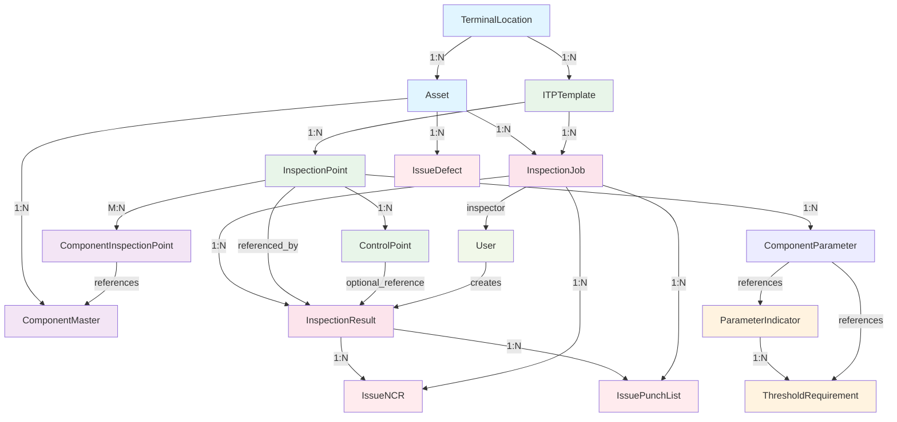
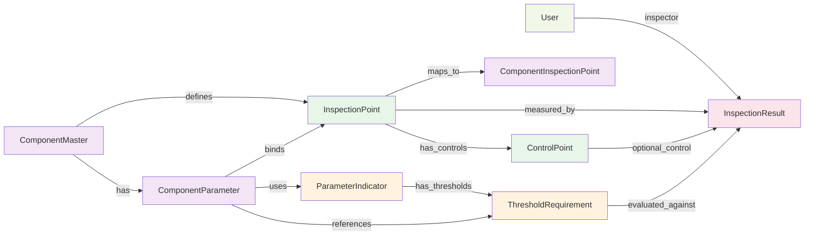
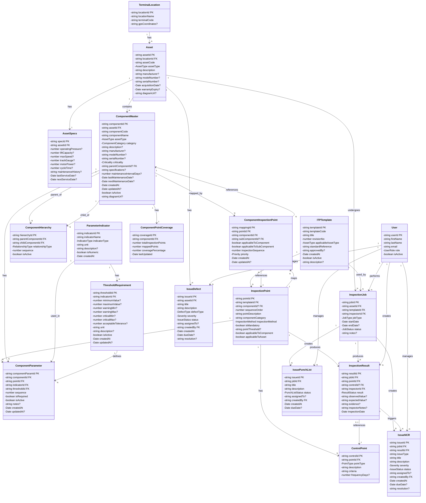
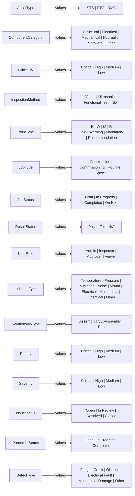

# CES (Component Inspection System) - Entity Diagram in Mermaid Format

**Document Version**: 1.0  
**Last Updated**: 2024  
**Status**: Complete and Verified

---

## Table of Contents

1. [Complete ER Diagram](#complete-er-diagram)
2. [Domain-Specific Diagrams](#domain-specific-diagrams)
3. [Data Flow Diagrams](#data-flow-diagrams)
4. [Class Diagram with Relationships](#class-diagram-with-relationships)

---

## Complete ER Diagram

```mermaid
erDiagram
    TERMINAL_LOCATION ||--o{ ASSET : "has"
    ASSET ||--|| ASSET_SPECS : "has"
    ASSET ||--o{ COMPONENT_MASTER : "contains"
    ASSET ||--o{ INSPECTION_JOB : "undergoes"
    ASSET ||--o{ ISSUE_DEFECT : "has"
    
    ITP_TEMPLATE ||--o{ INSPECTION_POINT : "defines"
    ITP_TEMPLATE ||--o{ INSPECTION_JOB : "used_by"
    
    INSPECTION_POINT ||--o{ CONTROL_POINT : "has"
    INSPECTION_POINT ||--o{ INSPECTION_RESULT : "produces"
    INSPECTION_POINT ||--o{ COMPONENT_INSPECTION_POINT : "maps_to"
    INSPECTION_POINT ||--o{ COMPONENT_PARAMETER : "associated_with"
    
    COMPONENT_MASTER ||--o{ COMPONENT_HIERARCHY : "parent_of"
    COMPONENT_MASTER ||--o{ COMPONENT_HIERARCHY : "child_of"
    COMPONENT_MASTER ||--o{ COMPONENT_INSPECTION_POINT : "mapped_by"
    COMPONENT_MASTER ||--o{ COMPONENT_PARAMETER : "has"
    COMPONENT_MASTER ||--|| COMPONENT_POINT_COVERAGE : "has"
    
    PARAMETER_INDICATOR ||--o{ THRESHOLD_REQUIREMENT : "has"
    PARAMETER_INDICATOR ||--o{ COMPONENT_PARAMETER : "used_in"
    
    THRESHOLD_REQUIREMENT ||--o{ COMPONENT_PARAMETER : "defines"
    
    COMPONENT_PARAMETER }o--|| COMPONENT_MASTER : "belongs_to"
    COMPONENT_PARAMETER }o--|| INSPECTION_POINT : "measures"
    COMPONENT_PARAMETER }o--|| PARAMETER_INDICATOR : "uses"
    COMPONENT_PARAMETER }o--|| THRESHOLD_REQUIREMENT : "applies"
    
    INSPECTION_JOB ||--o{ INSPECTION_RESULT : "produces"
    INSPECTION_JOB ||--o{ ISSUE_NCR : "creates"
    INSPECTION_JOB ||--o{ ISSUE_PUNCH_LIST : "has"
    
    INSPECTION_RESULT ||--o{ ISSUE_NCR : "triggers"
    INSPECTION_RESULT }o--|| CONTROL_POINT : "references"
    INSPECTION_RESULT }o--|| INSPECTION_POINT : "measures"
    
    USER ||--o{ INSPECTION_JOB : "performs"
    USER ||--o{ INSPECTION_RESULT : "creates"
    USER ||--o{ ISSUE_NCR : "creates_or_assigns"
    USER ||--o{ ISSUE_PUNCH_LIST : "creates_or_assigns"
    USER ||--o{ ISSUE_DEFECT : "creates_or_assigns"
    
    COMPONENT_INSPECTION_POINT }o--|| INSPECTION_POINT : "references"
    COMPONENT_INSPECTION_POINT }o--|| COMPONENT_MASTER : "references"

    TERMINAL_LOCATION : string locationId PK
    TERMINAL_LOCATION : string locationName
    TERMINAL_LOCATION : string terminalCode
    TERMINAL_LOCATION : string gpsCoordinates "nullable"

    ASSET : string assetId PK
    ASSET : string locationId FK
    ASSET : string assetCode
    ASSET : enum assetType "STS|RTG|RMG"
    ASSET : string description
    ASSET : string manufacturer "nullable"
    ASSET : string modelNumber "nullable"
    ASSET : string serialNumber "nullable"
    ASSET : date acquisitionDate "nullable"
    ASSET : date warrantyExpiry "nullable"
    ASSET : string diagramUrl "nullable"

    ASSET_SPECS : string specId PK
    ASSET_SPECS : string assetId FK
    ASSET_SPECS : number operatingPressure "nullable"
    ASSET_SPECS : number liftCapacity "nullable"
    ASSET_SPECS : number maxSpeed "nullable"
    ASSET_SPECS : number trackGauge "nullable"
    ASSET_SPECS : number motorPower "nullable"
    ASSET_SPECS : number cycleTime "nullable"
    ASSET_SPECS : string maintenanceHistory "nullable"
    ASSET_SPECS : date lastServiceDate "nullable"
    ASSET_SPECS : date nextServiceDate "nullable"

    ITP_TEMPLATE : string templateId PK
    ITP_TEMPLATE : string templateCode
    ITP_TEMPLATE : string title
    ITP_TEMPLATE : number revisionNo
    ITP_TEMPLATE : enum applicableAssetType "STS|RTG|RMG"
    ITP_TEMPLATE : string standardReference
    ITP_TEMPLATE : string approvedBy "nullable"
    ITP_TEMPLATE : date createdAt
    ITP_TEMPLATE : boolean isActive
    ITP_TEMPLATE : string description "nullable"

    INSPECTION_POINT : string pointId PK
    INSPECTION_POINT : string templateId FK
    INSPECTION_POINT : string componentId FK "nullable"
    INSPECTION_POINT : number sequenceOrder
    INSPECTION_POINT : string pointDescription
    INSPECTION_POINT : string componentCategory
    INSPECTION_POINT : enum inspectionMethod "Visual|Ultrasonic|Functional Test|NDT"
    INSPECTION_POINT : boolean isMandatory
    INSPECTION_POINT : string pointThreshold "nullable"
    INSPECTION_POINT : boolean applicableToComponent
    INSPECTION_POINT : boolean applicableToAsset

    CONTROL_POINT : string controlId PK
    CONTROL_POINT : string pointId FK
    CONTROL_POINT : enum pointType "H|W|M|R"
    CONTROL_POINT : string description
    CONTROL_POINT : string criteria
    CONTROL_POINT : number frequencyDays "nullable"

    COMPONENT_MASTER : string componentId PK
    COMPONENT_MASTER : string assetId FK
    COMPONENT_MASTER : string componentCode
    COMPONENT_MASTER : string componentName
    COMPONENT_MASTER : enum assetType "STS|RTG|RMG"
    COMPONENT_MASTER : enum category "Structural|Electrical|Mechanical|Hydraulic|Software|Other"
    COMPONENT_MASTER : string description "nullable"
    COMPONENT_MASTER : string manufacturer "nullable"
    COMPONENT_MASTER : string modelNumber "nullable"
    COMPONENT_MASTER : string criticality
    COMPONENT_MASTER : string parentComponentId FK "nullable"
    COMPONENT_MASTER : date lastMaintenanceDate "nullable"
    COMPONENT_MASTER : date nextMaintenanceDate "nullable"
    COMPONENT_MASTER : boolean isActive
    COMPONENT_MASTER : string diagramUrl "nullable"

    COMPONENT_HIERARCHY : string hierarchyId PK
    COMPONENT_HIERARCHY : string parentComponentId FK
    COMPONENT_HIERARCHY : string childComponentId FK
    COMPONENT_HIERARCHY : enum relationshipType "Assembly|SubAssembly|Part"
    COMPONENT_HIERARCHY : number sequence
    COMPONENT_HIERARCHY : boolean isActive

    COMPONENT_INSPECTION_POINT : string mappingId PK
    COMPONENT_INSPECTION_POINT : string pointId FK
    COMPONENT_INSPECTION_POINT : string componentId FK
    COMPONENT_INSPECTION_POINT : string subComponentId FK "nullable"
    COMPONENT_INSPECTION_POINT : boolean applicableToComponent
    COMPONENT_INSPECTION_POINT : boolean applicableToSubComponent
    COMPONENT_INSPECTION_POINT : number inspectionSequence
    COMPONENT_INSPECTION_POINT : enum priority "Critical|High|Medium|Low"
    COMPONENT_INSPECTION_POINT : date createdAt
    COMPONENT_INSPECTION_POINT : date updatedAt "nullable"

    COMPONENT_POINT_COVERAGE : string coverageId PK
    COMPONENT_POINT_COVERAGE : string componentId FK
    COMPONENT_POINT_COVERAGE : number totalInspectionPoints
    COMPONENT_POINT_COVERAGE : number mappedPoints
    COMPONENT_POINT_COVERAGE : number coveragePercentage
    COMPONENT_POINT_COVERAGE : date lastUpdated

    PARAMETER_INDICATOR : string indicatorId PK
    PARAMETER_INDICATOR : string indicatorName
    PARAMETER_INDICATOR : enum indicatorType "Temperature|Pressure|Vibration|Noise|Visual|Electrical|Mechanical|Chemical|Other"
    PARAMETER_INDICATOR : string unit
    PARAMETER_INDICATOR : string description "nullable"
    PARAMETER_INDICATOR : boolean isNumeric
    PARAMETER_INDICATOR : date createdAt

    THRESHOLD_REQUIREMENT : string thresholdId PK
    THRESHOLD_REQUIREMENT : string indicatorId FK
    THRESHOLD_REQUIREMENT : number minimumValue "nullable"
    THRESHOLD_REQUIREMENT : number maximumValue "nullable"
    THRESHOLD_REQUIREMENT : number warningMin "nullable"
    THRESHOLD_REQUIREMENT : number warningMax "nullable"
    THRESHOLD_REQUIREMENT : number criticalMin "nullable"
    THRESHOLD_REQUIREMENT : number criticalMax "nullable"
    THRESHOLD_REQUIREMENT : number acceptableTolerance "nullable"
    THRESHOLD_REQUIREMENT : string unit
    THRESHOLD_REQUIREMENT : string description "nullable"
    THRESHOLD_REQUIREMENT : boolean isActive
    THRESHOLD_REQUIREMENT : date createdAt
    THRESHOLD_REQUIREMENT : date updatedAt "nullable"

    COMPONENT_PARAMETER : string componentParamId PK
    COMPONENT_PARAMETER : string componentId FK
    COMPONENT_PARAMETER : string pointId FK
    COMPONENT_PARAMETER : string indicatorId FK
    COMPONENT_PARAMETER : string thresholdId FK
    COMPONENT_PARAMETER : number sequence
    COMPONENT_PARAMETER : boolean isRequired
    COMPONENT_PARAMETER : boolean isActive
    COMPONENT_PARAMETER : string notes "nullable"
    COMPONENT_PARAMETER : date createdAt
    COMPONENT_PARAMETER : date updatedAt "nullable"

    INSPECTION_JOB : string jobId PK
    INSPECTION_JOB : string assetId FK
    INSPECTION_JOB : string templateId FK
    INSPECTION_JOB : string inspectorId FK
    INSPECTION_JOB : enum jobType "Construction|Commissioning|Routine|Special"
    INSPECTION_JOB : date startDate
    INSPECTION_JOB : date endDate "nullable"
    INSPECTION_JOB : enum status "Draft|In Progress|Completed|On Hold"
    INSPECTION_JOB : string notes "nullable"

    INSPECTION_RESULT : string resultId PK
    INSPECTION_RESULT : string jobId FK
    INSPECTION_RESULT : string pointId FK
    INSPECTION_RESULT : string controlId FK "nullable"
    INSPECTION_RESULT : string inspectorId FK
    INSPECTION_RESULT : enum result "Pass|Fail|N/A"
    INSPECTION_RESULT : string observedValue "nullable"
    INSPECTION_RESULT : string expectedValue "nullable"
    INSPECTION_RESULT : string evidence "nullable"
    INSPECTION_RESULT : string inspectorNotes "nullable"
    INSPECTION_RESULT : date inspectionDate
    INSPECTION_RESULT : string inspectorId FK

    USER : string userId PK
    USER : string firstName
    USER : string lastName
    USER : string email
    USER : enum role "Admin|Inspector|Approver|Viewer"
    USER : boolean isActive

    ISSUE_NCR : string issueId PK
    ISSUE_NCR : string jobId FK
    ISSUE_NCR : string resultId FK
    ISSUE_NCR : enum issueType "NCR"
    ISSUE_NCR : string title
    ISSUE_NCR : string description
    ISSUE_NCR : enum severity "Critical|High|Medium|Low"
    ISSUE_NCR : enum status "Open|In Review|Resolved|Closed"
    ISSUE_NCR : string assignedTo "nullable"
    ISSUE_NCR : string createdBy FK
    ISSUE_NCR : date createdAt
    ISSUE_NCR : date dueDate "nullable"
    ISSUE_NCR : string resolution "nullable"

    ISSUE_PUNCH_LIST : string issueId PK
    ISSUE_PUNCH_LIST : string jobId FK
    ISSUE_PUNCH_LIST : string title
    ISSUE_PUNCH_LIST : string description
    ISSUE_PUNCH_LIST : enum status "Open|In Progress|Completed"
    ISSUE_PUNCH_LIST : string assignedTo "nullable"
    ISSUE_PUNCH_LIST : string createdBy FK
    ISSUE_PUNCH_LIST : date createdAt
    ISSUE_PUNCH_LIST : date dueDate "nullable"

    ISSUE_DEFECT : string issueId PK
    ISSUE_DEFECT : string assetId FK
    ISSUE_DEFECT : string title
    ISSUE_DEFECT : string description
    ISSUE_DEFECT : enum defectType "Fatigue Crack|Oil Leak|Electrical Fault|Mechanical Damage|Other"
    ISSUE_DEFECT : enum severity "Critical|High|Medium|Low"
    ISSUE_DEFECT : enum status "Open|In Review|Resolved|Closed"
    ISSUE_DEFECT : string assignedTo "nullable"
    ISSUE_DEFECT : string createdBy FK
    ISSUE_DEFECT : date createdAt
    ISSUE_DEFECT : date dueDate "nullable"
    ISSUE_DEFECT : string resolution "nullable"
```

---

## Domain-Specific Diagrams

### Domain 1: Location & Asset Management

```mermaid
erDiagram
    TERMINAL_LOCATION ||--o{ ASSET : "located_at"
    ASSET ||--|| ASSET_SPECS : "has_specs"
    
    TERMINAL_LOCATION : string locationId PK
    TERMINAL_LOCATION : string locationName
    TERMINAL_LOCATION : string terminalCode
    TERMINAL_LOCATION : string gpsCoordinates

    ASSET : string assetId PK
    ASSET : string locationId FK
    ASSET : string assetCode
    ASSET : enum assetType
    ASSET : string description
    ASSET : string manufacturer
    ASSET : string modelNumber

    ASSET_SPECS : string specId PK
    ASSET_SPECS : string assetId FK
    ASSET_SPECS : number operatingPressure
    ASSET_SPECS : number liftCapacity
    ASSET_SPECS : number maxSpeed
    ASSET_SPECS : date lastServiceDate
    ASSET_SPECS : date nextServiceDate
```

### Domain 2: Template & Inspection Points

```mermaid
erDiagram
    ITP_TEMPLATE ||--o{ INSPECTION_POINT : "defines"
    INSPECTION_POINT ||--o{ CONTROL_POINT : "has_controls"
    
    ITP_TEMPLATE : string templateId PK
    ITP_TEMPLATE : string templateCode
    ITP_TEMPLATE : string title
    ITP_TEMPLATE : number revisionNo
    ITP_TEMPLATE : enum applicableAssetType
    ITP_TEMPLATE : boolean isActive

    INSPECTION_POINT : string pointId PK
    INSPECTION_POINT : string templateId FK
    INSPECTION_POINT : string componentId FK "nullable"
    INSPECTION_POINT : number sequenceOrder
    INSPECTION_POINT : string pointDescription
    INSPECTION_POINT : enum inspectionMethod
    INSPECTION_POINT : boolean isMandatory

    CONTROL_POINT : string controlId PK
    CONTROL_POINT : string pointId FK
    CONTROL_POINT : enum pointType
    CONTROL_POINT : string criteria
    CONTROL_POINT : number frequencyDays
```

### Domain 3: Components & Hierarchy

```mermaid
erDiagram
    ASSET ||--o{ COMPONENT_MASTER : "contains"
    COMPONENT_MASTER ||--o{ COMPONENT_HIERARCHY : "parent_child"
    COMPONENT_MASTER ||--|| COMPONENT_POINT_COVERAGE : "has_coverage"
    
    ASSET : string assetId PK
    ASSET : string assetCode

    COMPONENT_MASTER : string componentId PK
    COMPONENT_MASTER : string assetId FK
    COMPONENT_MASTER : string componentCode
    COMPONENT_MASTER : string componentName
    COMPONENT_MASTER : enum category
    COMPONENT_MASTER : enum criticality
    COMPONENT_MASTER : string parentComponentId FK "nullable"
    COMPONENT_MASTER : boolean isActive

    COMPONENT_HIERARCHY : string hierarchyId PK
    COMPONENT_HIERARCHY : string parentComponentId FK
    COMPONENT_HIERARCHY : string childComponentId FK
    COMPONENT_HIERARCHY : enum relationshipType
    COMPONENT_HIERARCHY : number sequence

    COMPONENT_POINT_COVERAGE : string coverageId PK
    COMPONENT_POINT_COVERAGE : string componentId FK
    COMPONENT_POINT_COVERAGE : number totalInspectionPoints
    COMPONENT_POINT_COVERAGE : number mappedPoints
    COMPONENT_POINT_COVERAGE : number coveragePercentage
```

### Domain 4: Parameters & Thresholds

```mermaid
erDiagram
    PARAMETER_INDICATOR ||--o{ THRESHOLD_REQUIREMENT : "has_thresholds"
    PARAMETER_INDICATOR ||--o{ COMPONENT_PARAMETER : "used_in"
    THRESHOLD_REQUIREMENT ||--o{ COMPONENT_PARAMETER : "referenced_by"
    
    PARAMETER_INDICATOR : string indicatorId PK
    PARAMETER_INDICATOR : string indicatorName
    PARAMETER_INDICATOR : enum indicatorType
    PARAMETER_INDICATOR : string unit
    PARAMETER_INDICATOR : boolean isNumeric

    THRESHOLD_REQUIREMENT : string thresholdId PK
    THRESHOLD_REQUIREMENT : string indicatorId FK
    THRESHOLD_REQUIREMENT : number minimumValue "nullable"
    THRESHOLD_REQUIREMENT : number maximumValue "nullable"
    THRESHOLD_REQUIREMENT : number warningMin "nullable"
    THRESHOLD_REQUIREMENT : number warningMax "nullable"
    THRESHOLD_REQUIREMENT : number criticalMin "nullable"
    THRESHOLD_REQUIREMENT : number criticalMax "nullable"
    THRESHOLD_REQUIREMENT : boolean isActive

    COMPONENT_PARAMETER : string componentParamId PK
    COMPONENT_PARAMETER : string componentId FK
    COMPONENT_PARAMETER : string pointId FK
    COMPONENT_PARAMETER : string indicatorId FK
    COMPONENT_PARAMETER : string thresholdId FK
    COMPONENT_PARAMETER : number sequence
    COMPONENT_PARAMETER : boolean isRequired
```

### Domain 5: Inspection Execution & Results

```mermaid
erDiagram
    INSPECTION_JOB ||--o{ INSPECTION_RESULT : "produces"
    INSPECTION_JOB ||--o{ ISSUE_NCR : "creates_ncr"
    INSPECTION_JOB ||--o{ ISSUE_PUNCH_LIST : "creates_punch"
    INSPECTION_RESULT ||--o{ ISSUE_NCR : "triggers_ncr"
    USER ||--o{ INSPECTION_JOB : "performs"
    USER ||--o{ INSPECTION_RESULT : "creates"
    
    INSPECTION_JOB : string jobId PK
    INSPECTION_JOB : string assetId FK
    INSPECTION_JOB : string templateId FK
    INSPECTION_JOB : string inspectorId FK
    INSPECTION_JOB : enum jobType
    INSPECTION_JOB : date startDate
    INSPECTION_JOB : enum status

    INSPECTION_RESULT : string resultId PK
    INSPECTION_RESULT : string jobId FK
    INSPECTION_RESULT : string pointId FK
    INSPECTION_RESULT : string inspectorId FK
    INSPECTION_RESULT : enum result
    INSPECTION_RESULT : string observedValue "nullable"
    INSPECTION_RESULT : date inspectionDate

    USER : string userId PK
    USER : string firstName
    USER : string lastName
    USER : string email
    USER : enum role

    ISSUE_NCR : string issueId PK
    ISSUE_NCR : string jobId FK
    ISSUE_NCR : string resultId FK
    ISSUE_NCR : string title
    ISSUE_NCR : enum severity
    ISSUE_NCR : enum status

    ISSUE_PUNCH_LIST : string issueId PK
    ISSUE_PUNCH_LIST : string jobId FK
    ISSUE_PUNCH_LIST : string title
    ISSUE_PUNCH_LIST : enum status
```

### Domain 6: Issues & Defects

```mermaid
erDiagram
    ASSET ||--o{ ISSUE_DEFECT : "has_defects"
    INSPECTION_JOB ||--o{ ISSUE_PUNCH_LIST : "creates"
    USER ||--o{ ISSUE_DEFECT : "manages"
    USER ||--o{ ISSUE_PUNCH_LIST : "manages"
    
    ASSET : string assetId PK
    ASSET : string assetCode

    ISSUE_DEFECT : string issueId PK
    ISSUE_DEFECT : string assetId FK
    ISSUE_DEFECT : string title
    ISSUE_DEFECT : enum defectType
    ISSUE_DEFECT : enum severity
    ISSUE_DEFECT : enum status

    ISSUE_PUNCH_LIST : string issueId PK
    ISSUE_PUNCH_LIST : string jobId FK
    ISSUE_PUNCH_LIST : string title
    ISSUE_PUNCH_LIST : enum status

    USER : string userId PK
    USER : string firstName
    USER : enum role
```

---

## Data Flow Diagrams

### Inspection Workflow Flow



### Component Parameter Configuration Flow



---

## Class Diagram with Relationships



---

## Enum Definitions



---

## Summary Statistics

| Aspect | Count |
|--------|-------|
| **Total Entities** | 20 |
| **One-to-Many Relationships** | 18 |
| **One-to-One Relationships** | 2 |
| **Many-to-Many Relationships** | 3 |
| **Total Relationships** | 28 |
| **Entities with Audit Fields** | 12 |
| **Entities with Status Fields** | 5 |
| **Enum Types** | 12 |
| **Optional/Nullable Fields** | 60+ |
| **Primary Key Fields** | 20 |
| **Foreign Key Fields** | 40+ |

---

## Usage Instructions

### Rendering These Diagrams

1. **In GitHub**: These diagrams will render automatically in markdown files
2. **In Markdown editors**: Use a Mermaid-compatible viewer (e.g., VS Code with Mermaid extension)
3. **Online**: Visit [mermaid.live](https://mermaid.live) and paste any diagram

### Customizing Diagrams

To modify any diagram:
1. Copy the mermaid code block
2. Edit the relationships, entities, or attributes
3. Re-render to visualize changes

### Exporting Diagrams

Use mermaid CLI or online tool to export as:
- SVG (vector - best for documentation)
- PNG (raster - best for presentations)
- PDF (best for printing)

---

**Document Status**: ✅ Complete  
**Version**: 1.0  
**Last Updated**: January 2024  
**Format**: Mermaid Markdown  

Generated from CES Component Inspection System data models
