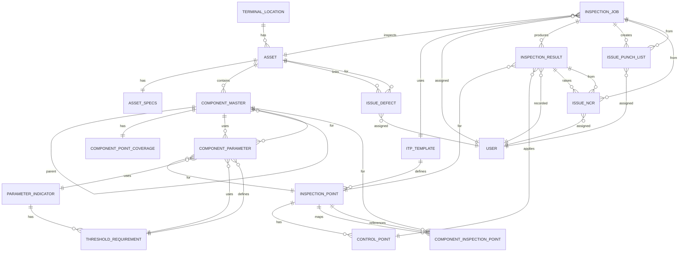

# Entity Relationship Diagram - Mermaid Format

---

## How to View These Diagrams

### In GitHub/GitLab
- The Mermaid diagram above will render automatically with interactive viewing and zooming

### In mermaid.live
1. Go to https://mermaid.live
2. Copy and paste the Mermaid code above
3. View, edit, and export as SVG or PNG

### In VS Code
1. Install "Markdown Preview Mermaid Support" extension
2. Open this file
3. Open Preview (Ctrl+Shift+V)
4. The diagram will render interactively

### In HTML Viewer
- Open `view-entity-diagram.html` in your browser for interactive features (zoom, download, print)

---

## Legend

- **||--o{** : One-to-Many relationship
- **||--||** : One-to-One relationship
- **}o--||** : Many-to-One relationship (reverse view)
- **}o--o{** : Many-to-Many relationship

---

## Relationships Summary

**Total Relationships: 28**

### One-to-Many (1:N) - 18 relationships
- TERMINAL_LOCATION → ASSET
- ASSET → COMPONENT_MASTER
- ASSET → ISSUE_DEFECT
- COMPONENT_MASTER → COMPONENT_MASTER (self-reference)
- COMPONENT_MASTER → COMPONENT_PARAMETER
- ITP_TEMPLATE → INSPECTION_POINT
- INSPECTION_POINT → CONTROL_POINT
- INSPECTION_POINT → COMPONENT_INSPECTION_POINT
- INSPECTION_JOB → INSPECTION_RESULT
- INSPECTION_JOB → ISSUE_PUNCH_LIST
- INSPECTION_RESULT → ISSUE_NCR
- PARAMETER_INDICATOR → THRESHOLD_REQUIREMENT
- THRESHOLD_REQUIREMENT → COMPONENT_PARAMETER
- ISSUE_NCR (multiple relationships)
- ISSUE_PUNCH_LIST (multiple relationships)
- ISSUE_DEFECT (multiple relationships)

### One-to-One (1:1) - 2 relationships
- ASSET → ASSET_SPECS
- COMPONENT_MASTER → COMPONENT_POINT_COVERAGE

### Many-to-One (M:1) - 8 relationships (reverse of One-to-Many)
- INSPECTION_JOB ← ASSET
- INSPECTION_JOB ← ITP_TEMPLATE
- INSPECTION_JOB ← USER
- INSPECTION_RESULT ← INSPECTION_POINT
- INSPECTION_RESULT ← CONTROL_POINT
- INSPECTION_RESULT ← USER
- COMPONENT_PARAMETER ← COMPONENT_MASTER
- And more...

---

## Entity Domains

### Location & Asset Domain
- TERMINAL_LOCATION
- ASSET
- ASSET_SPECS

### Component Domain
- COMPONENT_MASTER
- COMPONENT_HIERARCHY (implicit via self-reference)
- COMPONENT_POINT_COVERAGE

### Inspection Domain
- INSPECTION_JOB
- INSPECTION_RESULT
- INSPECTION_POINT

### Template Domain
- ITP_TEMPLATE
- CONTROL_POINT
- COMPONENT_INSPECTION_POINT

### Parameter Domain
- PARAMETER_INDICATOR
- THRESHOLD_REQUIREMENT
- COMPONENT_PARAMETER

### Issue Tracking Domain
- ISSUE_NCR
- ISSUE_PUNCH_LIST
- ISSUE_DEFECT

### User Domain
- USER

---

## Notes

- All field definitions have been removed from this Mermaid diagram format (Mermaid erDiagram doesn't support field definitions in the same way)
- For complete field definitions, see `ENTITY_DIAGRAM.md`
- For system architecture overview, see `ARCHITECTURE_DIAGRAM.md`
- Cardinality notation follows Mermaid ERD standards
